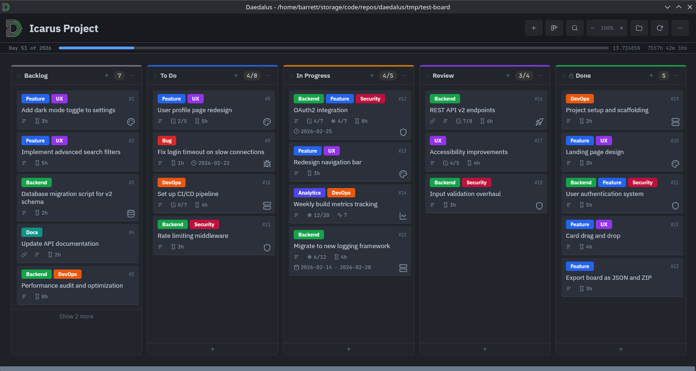

# Daedalus

A lightweight, offline-first kanban board desktop app.

Boards are plain directories of markdown files - no databases, no cloud, no accounts.

Built as a fast, personal replacement for Trello that plays nicely with Obsidian and other markdown tools.



See more screenshots in [docs/screenshots/](docs/screenshots)

## Why

- **Trello was using 1-3 GB of RAM** for a large single board. Dragging cards would lag or fail entirely on this board
- **Obsidian's Kanban plugin** didn't do what I needed without a pile of community plugins and needless complexity
- **I wanted my data as plain files** - editable in any text editor, easy to back up, easy for AI agents to read

Daedalus uses ~60 MB of RAM and loads boards in under 100ms.
Note: This depends on board size, but for reference I went from 1-3GB RAM on Trello to ~200MB RAM loading the same board in Daedalus.

## Features

- **Markdown cards** with YAML frontmatter - edit in Daedalus, Obsidian, vim, or any text editor
- **File watcher** - auto-reloads when cards are edited externally
- **Drag and drop** - cards between lists, list column reordering
- **Rich card fields** - labels, icons, due dates, date ranges, checklists, counters, time series, estimates, URLs
- **Card templates** - predefined structures with preset fields, labels, and checklists
- **Search and filter** - full-text search with `#label`, `icon:`, and `url:` filter prefixes
- **Wiki-style linking** - `[[card-id]]` links between cards
- **Keyboard navigation** - arrow keys, shortcuts for common actions, `?` for help
- **Custom icons** - upload SVG/PNG icons for cards and lists
- **Board scratchpad** - persistent markdown notepad alongside the board
- **Multiple boards** - switch between boards, set a default, recent board history
- **Export** - JSON and ZIP formats
- **Zoom and view modes** - zoom in/out, minimal card view
- **Board statistics** - card counts by label, list, and other breakdowns
- **CLI tool** - `daedalus-cli` for scripting and automation

## Stack

- **Backend**: Go 1.23 with [Wails v2](https://wails.io/)
- **Frontend**: Svelte 5 with TypeScript and SCSS
- **Data**: Directories = lists, `.md` files = cards, `board.yaml` = config

## Board Format

A board is a directory with this structure:

```
my-board/
  board.yaml              # Board config (list order, labels, templates, preferences)
  scratchpad.md           # Optional board-level notes
  _assets/icons/          # Custom SVG/PNG icons
  backlog/                # Each directory is a list
    1.md                  # Each .md file is a card
    2.md
  in-progress/
    3.md
  done/
    4.md
```

### Card Format

Cards are markdown files with YAML frontmatter:

```yaml
---
id: 42
title: Implement OAuth2
list_order: 1
created: 2026-02-05T09:00:00-05:00
updated: 2026-02-18T14:20:00-05:00
due: 2026-02-25T17:00:00-05:00
labels:
    - Feature
    - Backend
icon: shield.svg
url: https://github.com/org/repo/pull/142
estimate: 8
counter:
    current: 4
    max: 7
    step: 1
    label: Endpoints
checklist:
    label: Implementation Steps
    items:
        - desc: "Set up provider config"
          done: true
          idx: 0
        - desc: "Write integration tests"
          done: false
          idx: 1
timeseries:
    label: Build Time (sec)
    entries:
        - t: "2026-01-06"
          v: 142
        - t: "2026-01-13"
          v: 128
range:
    start: 2026-02-14T09:00:00-05:00
    end: 2026-02-28T17:00:00-05:00
---
# Implement OAuth2

Card body in markdown...
```

All frontmatter fields except `id`, `title`, and `list_order` are optional.
Unknown YAML keys are preserved through round-trips, so cards edited by other tools won't lose data.

### Trello Fields

If a card was migrated from Trello export JSON, some Trello fields are maintained in the YAML frontmatter.
See Trello migration section below.

```yml
trello_data:
  id: xxx
  url: https://trello.com/c/BOARD_ID/CARD_ID-card-title
  date_closed: None
  date_last_activity: 2026-01-23T17:09:26.602Z
  date_completed: None
```

## Custom Icons

Daedalus doesn't ship with icons to stay small. Upload your own SVG or PNG files through the icon manager, or drop them into `_assets/icons/`.

Good sources: [Lucide](https://lucide.dev/icons), [Simple Icons](https://simpleicons.org/), or any site's favicon.

```sh
# Convert .ico to .png if needed
python3 -c "from PIL import Image; Image.open('favicon.ico').save('favicon.png')"
```

## CLI

`daedalus-cli` provides scriptable access to boards:

```sh
daedalus-cli --board ~/boards/my-board board                       # get board summary
daedalus-cli --board ~/boards/my-board lists                       # get all lists
daedalus-cli --board ~/boards/my-board cards todo                  # get cards in a list
daedalus-cli --board ~/boards/my-board card-get 42                 # get full card details by ID
daedalus-cli --board ~/boards/my-board card-create todo "New task" # create a task
daedalus-cli --board ~/boards/my-board card-delete 42              # delete a card by ID
daedalus-cli --board ~/boards/my-board list-create backlog         # create a list
daedalus-cli --board ~/boards/my-board list-delete backlog         # delete a list by name
daedalus-cli --board ~/boards/my-board export-json out.json        # export board as JSON
daedalus-cli --board ~/boards/my-board export-zip out.zip          # export board as zip
```

All output is JSON for easy piping to `jq` or other tools.

## Trello Migration

Export your Trello board as JSON, then convert:

```sh
python3 scripts/trello_to_md.py --input trello_export.json --output ~/boards/my-board
```

This creates list directories and card markdown files with frontmatter metadata from the Trello export.

## Limitations

- Only tested on Linux, but should mostly work on Windows/Mac if I didn't miss any cross-platform problems.
- `daedalus-cli` not fully tested. This was a nice to have for automation, but I don't really use it in my workflow yet.

## Development

### Dependencies (Arch Linux)

```sh
sudo pacman -Syu --needed base-devel gtk3 webkit2gtk svt-av1 libavif npm go
go install github.com/wailsapp/wails/v2/cmd/wails@latest
wails doctor  # verify all dependencies
```

### Commands

```sh
wails dev              # Development server with hot reload
wails build            # Production build
go test ./...          # Run Go tests
cd frontend && npx svelte-check  # TypeScript/Svelte type checking
```

### Debug Logging

```sh
DAEDALUS_DEBUG=1 wails dev
```

## Future Features

Features that I originally thought up, but I need to think about it more.

- Card dependencies. ex: Card B is blocked by Card A
- Dependency graph view
- Recurring tasks. ex: Card created and due every Tuesday at 12:00 PM. Maybe not cards, but like a daily checklist thing?
- Habit tracking - Track something over a date range or limitless. Check off daily or configurable interval?
- Epics (multiple cards) and Sagas (multiple epics) - useful for trying to track giant goals
- Calendar view - display cards, recurring tasks, etc.
- MCP server - give easy access to AI agents. I'm not there yet in my workflow, but should be relatively easy since it could probably use the same functions as the CLI
